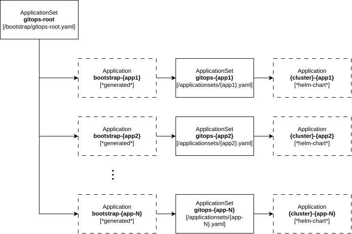
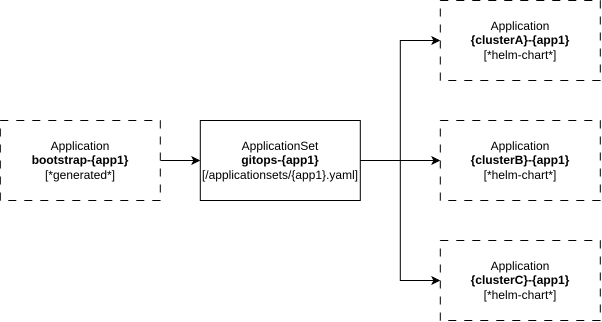

# Single Repo, Multiple Clusters GitOps Example

## Entrypoint

The main gitops entrypoint is `/bootstrap/gitops-apps-root.yaml`. The bootstrap ApplicationSet polls the `applicationset/` directory in Git
for additional ApplicationSets to deploy. Most of the ApplicationSets targets a specific environment and clusters labeled with
those environments.

## Visual breakdown

The Root App [(`/bootstrap/gitops-apps-root.yaml`)](/bootstrap/gitops-apps-root.yaml) is defined as an ApplicationSet which scans the git repo directories (`applicationset/**`) to determine what apps should be defined.

Each Application will have a generated bootstrap application in ArgoCD. Each application is defined in an ApplicationSet that allows for ArgoCD to generate an Application for each cluster. App/Cluster control of Application generation/deployment is defined inside the ApplicationSet.  

Examples:  
* [External Secrets](/applicationset/external-secrets/applicationset.yaml), deploys to all clusters  
* [Hashicorp Vault](/applicationset/hashicorp-vault/applicationset.yaml), deploys to hub cluster  
* [Jellyfin](/applicationset/jellyfin/applicationset.yaml), deploys to production clusters  

## References

* [Multicloud Integrations](https://github.com/stolostron/multicloud-integrations)
* [Red Hat COP - Helm Charts](https://github.com/redhat-cop/helm-charts)
* [Red Hat COP - ACM Policies](https://github.com/redhat-cop/acm-policies)
* [RHACM GitOps](https://github.com/josgonza-rh/rhacm-gitops)
* [RHACM Policy](https://guifreelife.com/blog/2024/03/11/Placing-Open-Cluster-Management-Policies-on-Kubernetes/)
* [RHACM and Compliance Operator](https://jaosorior.dev/2021/writing-rhacm-policies-to-leverage-the-compliance-operator/)
